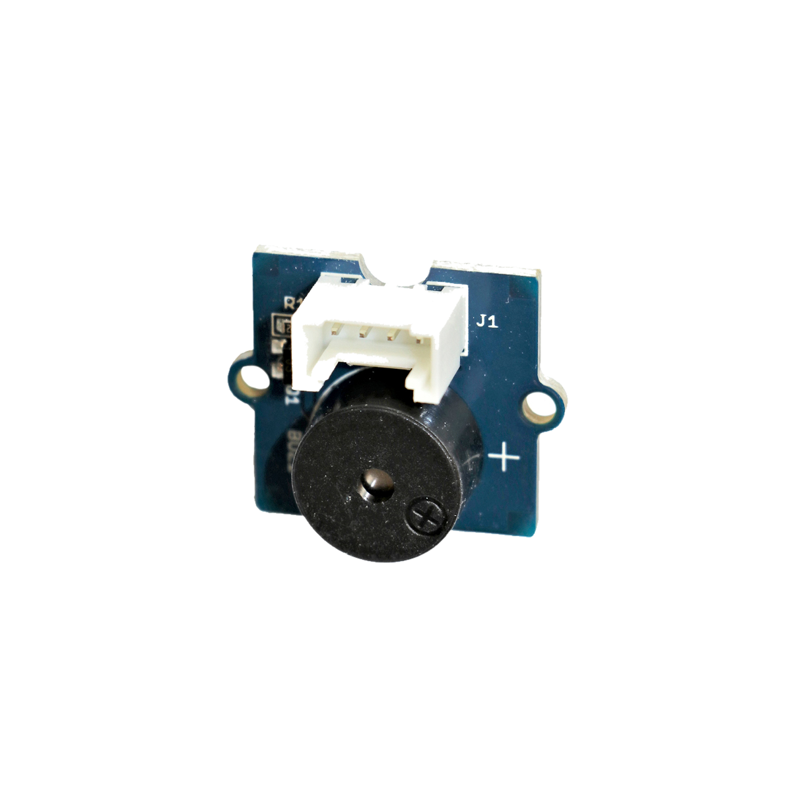

# Summer

## Beschreibung
Der Summer gibt Pieptöne in unterschiedlichen Tonhöhen aus. Dafür wird der Summer direkt oder mithilfe des Grove Shields an einen Arduino oder Raspberry Pi angeschlossen. Durch ein einfaches digitales „HIGH“ oder „LOW”-Signal kann der Pieper an- oder ausgeschaltet werden. Alternativ kann er auch Effekte oder unterschiedliche Tonhöhen ausgeben, wenn er durch ein PWM-Signal angesteuert wird.

Der Summer wird oftmals als Warnton oder auch als akustisches Feedback in diversen Projekten eingesetzt.

Alle weiteren Hintergrundinformationen sowie ein Beispielaufbau und alle notwendigen Programmbibliotheken sind auf dem offiziellen Wiki (bisher nur in englischer Sprache) von Seeed Studio zusammengefasst. Zusätzlich findet man über alle gängigen Suchmaschinen meist nur mit der Eingabe der genauen Komponentenbezeichnungen entsprechende Projektbeispiele und Tutorials.

<!-- infolist -->

<!-- infolists -->
## Wichtige Links für die ersten Schritte:

- [Seeed Studio Wiki](http://wiki.seeedstudio.com/Grove-Buzzer/) [- Summer](http://wiki.seeedstudio.com/Grove-Buzzer/)

## Projektbeispiele:

- [Arduino-Tutorials - PacMan mit Sound](https://www.arduino-tutorial.de/so-baut-man-einen-tisch-pac-man/)
- [Funduino - Sound erzeugen](https://funduino.de/nr-08-toene-erzeugen)

## Weiterführende Hintergrundinformationen:

- [GPIO - Wikipedia Artikel](https://de.wikipedia.org/wiki/Allzweckeingabe/-ausgabe)
- [GitHub-Repository: Summer](https://github.com/MakeYourSchool/45-Summer)

